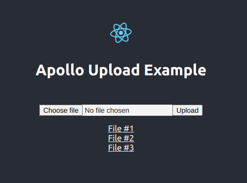
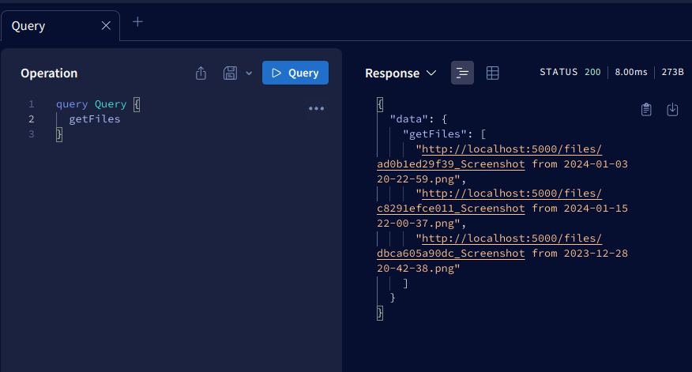

# React GraphQL Apollo (v3) Example

### Prerequisites

- [pnpm](https://pnpm.io)
- [Node.js](https://nodejs.org)

### Get Started

- Install dependencies
```bash
pnpm run install
```
- Run dev server
```bash
pnpm dev
```

### Screenshots


